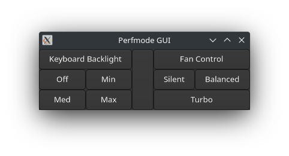

# Perfmode

Perfmode is a performance control utility for ASUS TUF Gaming series of laptops. It allows both fan control and backlight control of the laptop.

Performance modes available:

- Turbo
- Balanced
- Silent

Keyboard backlight options available:

- Off
- Min
- Med
- Max

## Usage

### Command Line mode

```bash
$ sudo perfmode -op option 
```

- Viewing Help

```bash
$ perfmode --help
```
> Keyboard backlight modes work without sudo. To do Fan Control, sudo is still required

### GUI -- Warning! Deprecated in release 3.1.1

GUI has been removed from the current release in favor of the upcoming GUI!

Please use an old release i.e before `3.1.1` or an older commit and compile from source!


```bash
$ perfmode
```

Without any aguments to perfmode, A GUI will be launched. Run with sudo for fan control otherwise
 only LED Control is available without elevated permissions.

The GUI is still in beta and there exists an issue. Please check the issues section for more information if you're interested.


## Installation

### Arch Linux

Arch or Arch based distributions can directly install from the AUR. You can either use an AUR Helper or 
follow the given steps to install manually.

- Package [link](https://aur.archlinux.org/packages/perfmode)

```bash
git clone https://aur.archlinux.org/perfmode.git

cd perfmode

makepkg -si
```


### Dependencies

- A C Compiler
- make

### Compiling

Compile using the following commands:

- Using Make

```bash
$ make
# optional - installs to /usr/local/bin
$ sudo make install
```


### Troubleshooting

The following is a list of errors reported by faustus and how to fix them.

- `Perfmode: Kernel modules not available`

If you see this error while running, then make sure you have not disabled `asus_nb_wmi` or `faustus` modules. If you have no idea what this means then there is a very high possibility that you are running the default `asus_nb_wmi` module. You can load it by running the following command:

```bash
$ sudo modprobe asus_nb_wmi
```

Similarly, for faustus (if you have it installed) you can simple replace `asus_nb_wmi` with `faustus`

- `Perfmode: Module files not found`

This error reports that policy files for managing your hardware do not exist.

Either you're on unsupported hardware or you're probably missing the `linux-firmware` package.

Please install it for your respective distribution.

- Perfmode: Insufficient Permissions

This error reports that perfmode does not have enough permissions to open the policy file.

Run perfmode with `sudo` to fix this.

